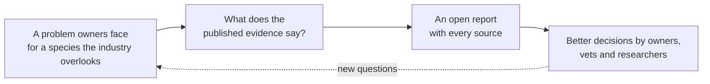
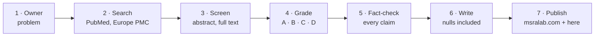
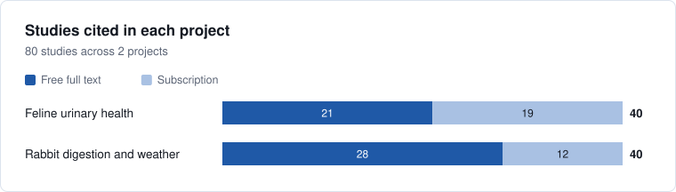
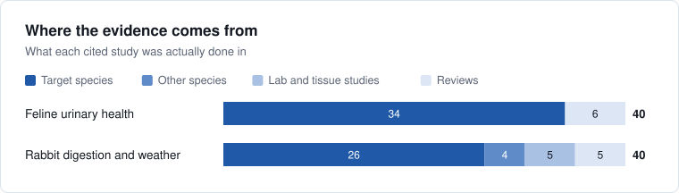
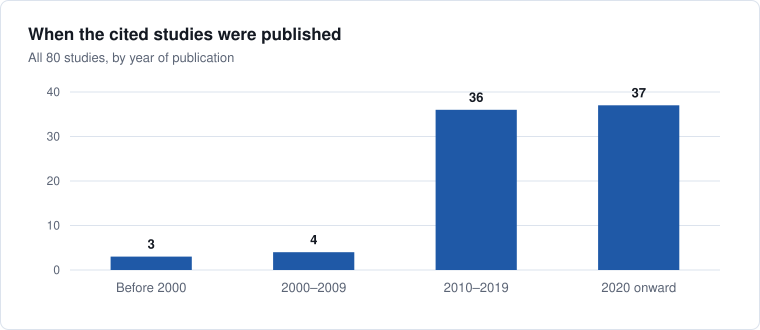
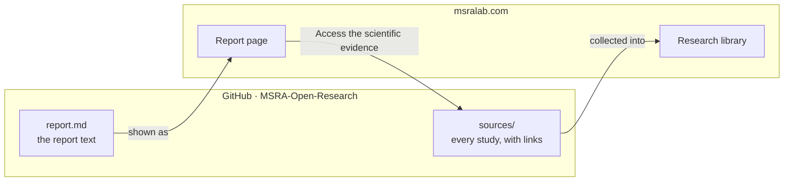

# MSRA Open Research

**MSRA stands for Mystical Species Research Academy.** We are an AI-powered research lab for animal health and nutrition. This repository is our open knowledge base: every research project we publish, with every study behind it, free for anyone to read, check and reuse.

[](https://msralab.com)
[](https://msralab.com/research/)
[](https://msralab.com/research/library/)
[](LICENSE)

---

## Our vision

**Every species and every condition deserves the same standard of care.**

Pet health research and pet products are built overwhelmingly for dogs and cats. A rabbit that stops eating when the weather turns, a parrot that plucks itself bare, a tortoise slow to feed after brumation: their owners usually find a relabelled dog product, a forum thread, or nothing. Even for cats, common problems such as urinary blockages are surrounded by advice that the evidence does not support.

We think the answer starts with evidence that anyone can see. So we research one species and one problem at a time, write down what the studies actually show, including the trials that found nothing, and publish all of it here.



## What we share

| In every project | What it gives you |
|---|---|
| **A research report** | The question, how we searched, what the evidence supports, what it does not, and what it means for owners. Published on [msralab.com/research](https://msralab.com/research/). |
| **Every source** | Each study the report cites, numbered as in the report, with a link to PubMed and to the free full text where one exists. Kept in the project's `sources/` folder. |
| **Evidence grades** | For each finding: was it a controlled trial in the species itself, a study in another species, a lab study, or no data at all. |
| **The limits** | A section in every report on where the evidence stops, so nothing is overstated. |
| **The history** | Every change to a project is visible in this repository's commit history. Corrections stay on the record. |

We publish literature research. Reports summarise published studies; they are not veterinary advice.

## How we do it



1. **Start from real problems.** We read what owners describe in their own words and rank problems by how deep the need is and how poorly it is served.
2. **Search widely.** Our AI-powered research system runs many searches per question across PubMed and Europe PMC, which makes it practical to read far more of the literature than a traditional review team could in the same time.
3. **Screen and read.** Records are screened at title and abstract level, and the relevant ones are read in full where the full text is available.
4. **Grade the evidence.** Each finding is graded by how directly it answers the question for the species in question:

   | Grade | Meaning |
   |---|---|
   | **A** | Randomised controlled trial in the target species, on the outcome in question |
   | **B** | Controlled trial in the target species on a related outcome, or a randomised trial in a closely related species |
   | **C** | Laboratory or tissue study, an uncontrolled study, or evidence from a distant species |
   | **D** | No data: traditional or marketing use only |

5. **Fact-check.** Every statement is checked against the paper it cites. Every PubMed ID is re-verified, and quoted numbers are checked against the abstract or full text. Where our working notes disagree with a paper, the paper wins.
6. **Report the nulls.** Trials that found no effect are reported as clearly as trials that did. Where no evidence exists, we write that it was not found rather than fill the gap.
7. **Publish.** The report goes live on msralab.com and its sources live here, with links between the two.

**Safety comes first.** An ingredient that is common in dog or human products can be wrong for a rabbit or a bird, so harm in the target species is considered before benefit.

## Projects

| Project | Species | Published | Studies cited | Read |
|---|---|---|---|---|
| **Preventing urinary blockages in cats: what the evidence supports** | Cats | 2026-08-20 | 40 (21 free full text) | [Report](https://msralab.com/research/project/?p=2026-08-feline-urinary-health) · [Sources](2026-08-feline-urinary-health/sources/) |
| **Rabbit digestion in hot and cold weather: what the evidence supports** | Rabbits | 2026-09-10 | 40 (28 free full text) | [Report](https://msralab.com/research/project/?p=2026-09-rabbit-digestion-weather) · [Sources](2026-09-rabbit-digestion-weather/sources/) |

## The knowledge base in numbers







The charts are drawn from each project's `sources/sources.csv` by [`tools/make_charts.py`](tools/make_charts.py), so they stay in step with the projects.

## How this repository and the website fit together



The website reads this repository directly: each report page links to its sources here, and each project folder here links back to its report on msralab.com. Publishing or correcting a project here updates the website within minutes, with no other step.

## Use a project

**If you are a pet owner:** open the report on [msralab.com/research](https://msralab.com/research/). Start with the key findings and the section for owners, and take the report to your vet.

**If you want to check a claim:** every claim in a report carries a number like `[12]`. Open the project's `sources/` folder on GitHub and find study 12: it links to PubMed and, where available, to the free full text.

**If you work with data:** each project's `sources/sources.csv` is a plain table, one row per study.

| Column | Meaning |
|---|---|
| `ref` | Reference number in the report |
| `title`, `authors`, `journal`, `year` | The study |
| `pmid`, `doi` | PubMed ID and DOI |
| `pmc` | PubMed Central ID; present only when the full text is free to read |
| `studied_in` | What the study was actually done in (species, setting, tissue, or a review) |
| `tags` | Species groups, separated by semicolons |
| `topic` | Short topic label |
| `used_for` | The project the study belongs to |

```python
import pandas as pd

base = "https://raw.githubusercontent.com/chicco4life/MSRA-Open-Research/main/"
df = pd.read_csv(base + "2026-09-rabbit-digestion-weather/sources/sources.csv")

free = df[df["pmc"].notna()]                       # studies with free full text
heat = df[df["topic"].str.startswith("Heat stress")] # one topic
print(len(df), "studies,", len(free), "free to read")
```

**If you write about animal health:** reuse anything here under [CC BY 4.0](LICENSE), with credit and a link.

## How the repository is organised

```
MSRA-Open-Research/
├── README.md                          this page
├── CONTRIBUTING.md                    how to add a project or a correction
├── LICENSE                            CC BY 4.0
├── assets/charts/                     the charts on this page
├── tools/make_charts.py               redraws the charts from the sources
├── 2026-08-feline-urinary-health/
│   ├── README.md                      overview, key findings, links to the report and sources
│   ├── report.md                      the report text shown on msralab.com
│   └── sources/
│       ├── README.md                  every study cited, with links to read it
│       └── sources.csv                the same list as a table
└── 2026-09-rabbit-digestion-weather/
    └── … the same shape
```

## Cite

> MSRA Open Research (2026). *Rabbit digestion in hot and cold weather: what the evidence supports.* https://msralab.com/research/project/?p=2026-09-rabbit-digestion-weather

Use the same pattern for any project: title, year, and the link to its report on msralab.com.

The studies we list belong to their authors and publishers. We link to them; we do not host copies.

## Contribute

- **Suggest a study or a correction:** [open an issue](https://github.com/chicco4life/MSRA-Open-Research/issues/new).
- **Add a project:** see [CONTRIBUTING.md](CONTRIBUTING.md).

## Disclaimer

These reports summarise published research for information. They are not veterinary advice. If your animal is unwell, talk to a vet.
